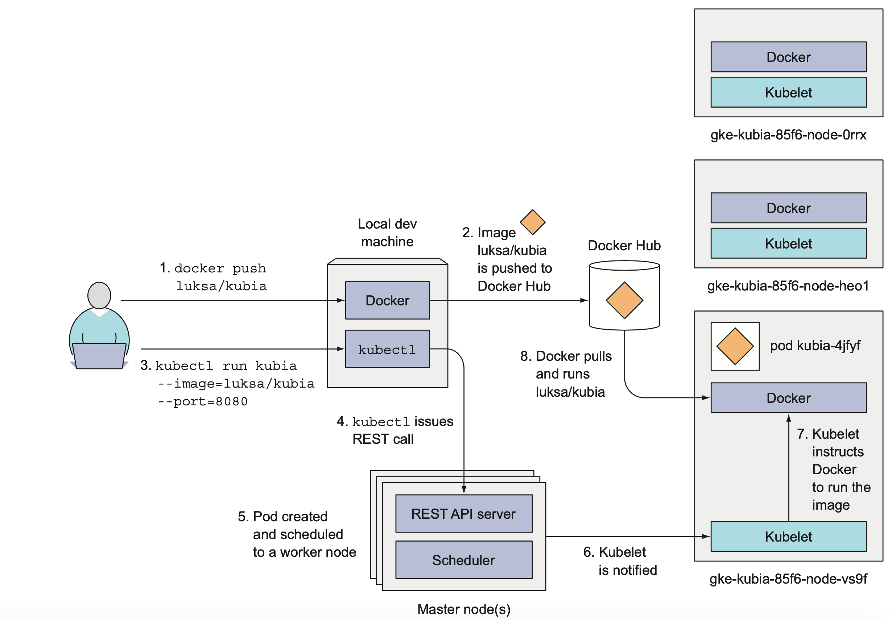
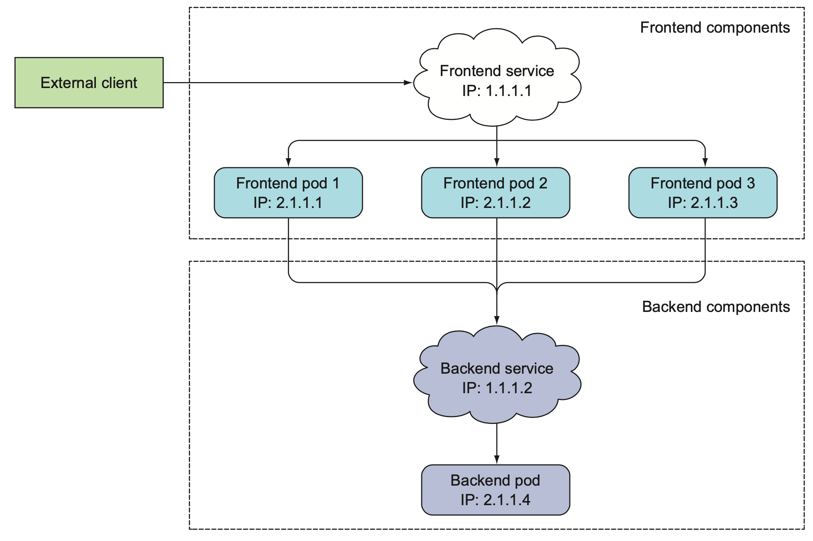
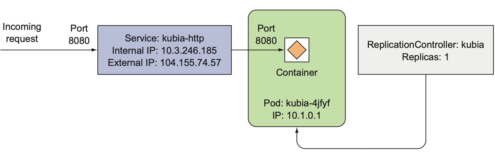
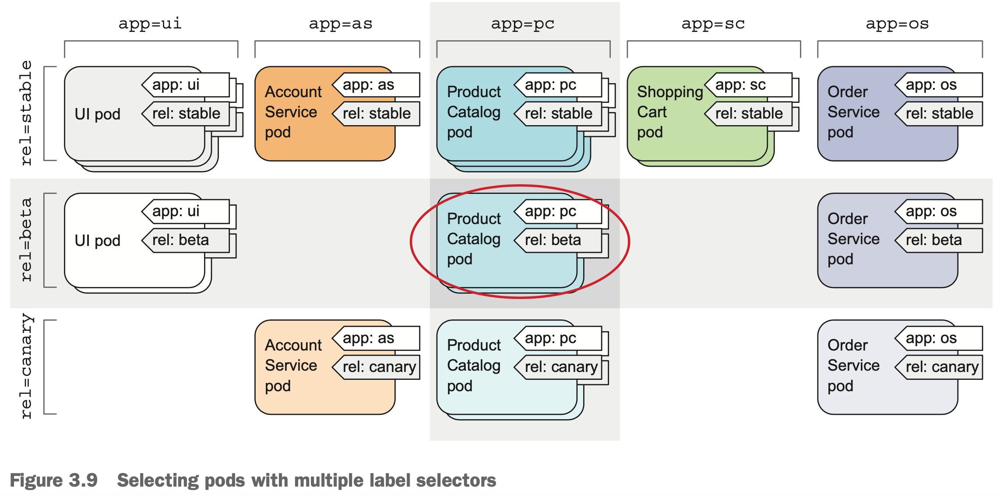
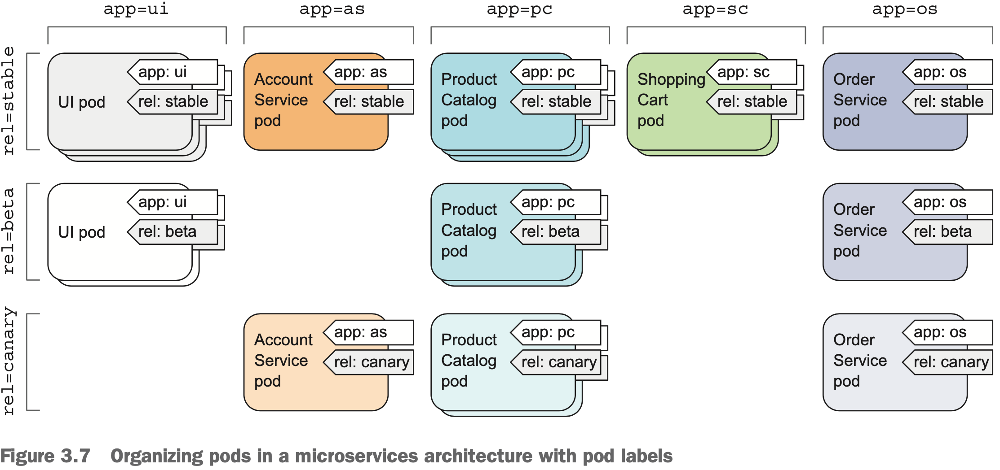
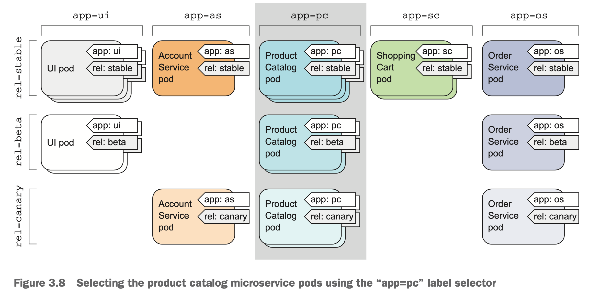
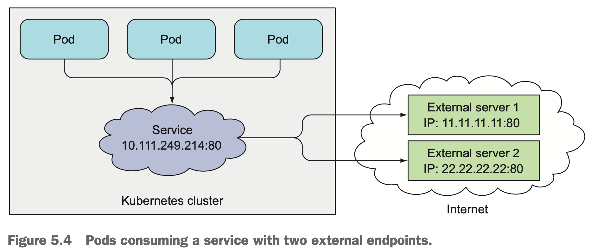
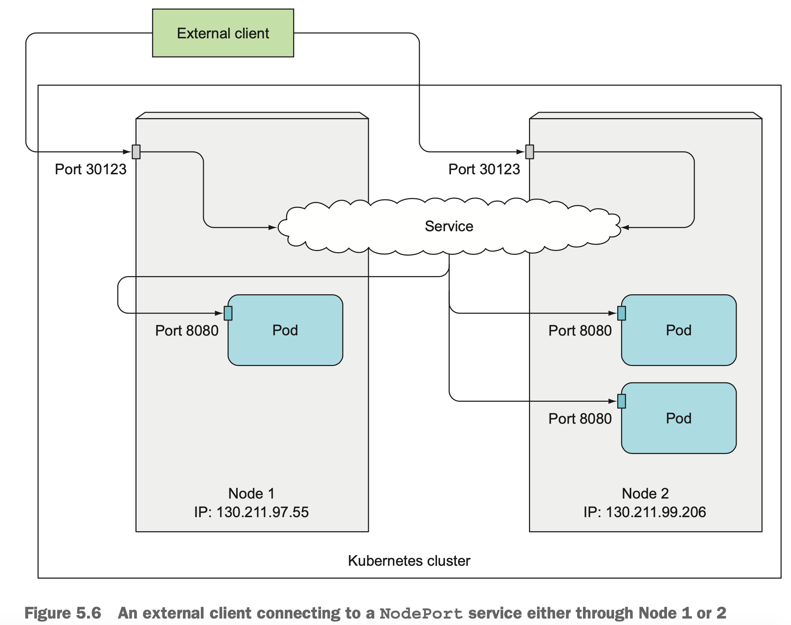

Kubernetes

<!-- TOC -->
  * [Kubernetes architecture](#kubernetes-architecture)
    * [**1. Separation of Concerns**](#1-separation-of-concerns)
    * [**2. Modularity**](#2-modularity)
    * [**3. Reusability and Scaling**](#3-reusability-and-scaling)
    * [**4. Declarative + Automated Control**](#4-declarative--automated-control)
    * [Analogy](#analogy)
  * [Creating deployment](#creating-deployment)
    * [Full YAML Example (Recommended for Production)](#full-yaml-example-recommended-for-production)
  * [Kubernetes Labels & Selectors (2025 Updated Notes)](#kubernetes-labels--selectors-2025-updated-notes)
    * [1. Organizing Kubernetes Objects with Labels](#1-organizing-kubernetes-objects-with-labels)
    * [2. Modifying Labels on Existing Objects](#2-modifying-labels-on-existing-objects)
    * [3. Label Selectors for Operations](#3-label-selectors-for-operations)
    * [Advanced Label Selectors](#advanced-label-selectors)
  * [Kubernetes Services](#kubernetes-services)
    * [Summary Table](#summary-table)
  * [Connecting to services outside k8s cluster](#connecting-to-services-outside-k8s-cluster)
    * [What is `kind: Endpoints`?](#what-is-kind-endpoints)
    * [When to use](#when-to-use)
    * [Important notes](#important-notes)
    * [Example:](#example)
  * [How does an `ExternalName` service link to its target?](#how-does-an-externalname-service-link-to-its-target)
    * [Key Differences](#key-differences)
    * [How it Works](#how-it-works)
    * [Example](#example-1)
    * [Key Point](#key-point)
  * [Exposing services to external clients](#exposing-services-to-external-clients)
    * [2. **LoadBalancer Service (AWS ELB)**](#2-loadbalancer-service-aws-elb)
      * [YAML](#yaml)
      * [Steps](#steps)
    * [3. **Ingress (with NGINX Ingress Controller)**](#3-ingress-with-nginx-ingress-controller)
      * [YAML for your app + ingress](#yaml-for-your-app--ingress)
      * [Steps](#steps-1)
    * [Summary](#summary)
    * [Call Chain Recap with Roles](#call-chain-recap-with-roles)
      * [Step-by-step call chain `curl http://myapp.example.com/`](#step-by-step-call-chain-curl-httpmyappexamplecom)
      * [Example (For `myapp.example.com`):](#example-for-myappexamplecom)
  * [Diagram Summary:](#diagram-summary)
    * [Detailed Walkthrough with Comments in YAML](#detailed-walkthrough-with-comments-in-yaml)
    * [Final Call Chain (with Responsibilities)](#final-call-chain-with-responsibilities)
    * [Ingress Multiple services](#ingress-multiple-services)
      * [1. Services for each app:](#1-services-for-each-app)
      * [2. Ingress Resource](#2-ingress-resource)
      * [How Requests Are Routed:](#how-requests-are-routed)
      * [What You Need:](#what-you-need)
  * [Final example with microservices architecture](#final-example-with-microservices-architecture)
    * [1️⃣ ClusterIssuer (for cert-manager TLS)](#1-clusterissuer-for-cert-manager-tls)
    * [2️⃣ Ingress Controller Deployment + 3️⃣ LoadBalancer Service (ELB)](#2-ingress-controller-deployment--3-loadbalancer-service-elb)
    * [4️⃣ Ingress Resource with TLS and Path Routing](#4-ingress-resource-with-tls-and-path-routing)
    * [5️⃣ ClusterIP Services (Internal Routing to Pods)](#5-clusterip-services-internal-routing-to-pods)
    * [6️⃣ Deployments (Pods Running Application Code)](#6-deployments-pods-running-application-code)
    * [REQUEST FLOW FROM CLIENT TO PODS](#request-flow-from-client-to-pods)
  * [Templating using Help and Kustomize](#templating-using-help-and-kustomize)
  * [Custom Resources in k8s](#custom-resources-in-k8s)
    * [**1. Kubernetes Resource Model & Controller Pattern**](#1-kubernetes-resource-model--controller-pattern)
    * [**2. Writing Kubernetes Operators (Kubebuilder or Operator SDK)**](#2-writing-kubernetes-operators-kubebuilder-or-operator-sdk)
    * [**3. Kubernetes RBAC (Role-Based Access Control)**](#3-kubernetes-rbac-role-based-access-control)
    * [**4. CNI (Container Network Interface)**](#4-cni-container-network-interface)
    * [**5. OIDC (OpenID Connect)**](#5-oidc-openid-connect)
    * [How They All Interact in Real-World Architecture](#how-they-all-interact-in-real-world-architecture)
    * [Summary Table](#summary-table-1)
    * [Steps to create one custom resource (CR)](#steps-to-create-one-custom-resource-cr)
      * [Demo:](#demo)
      * [Purpose of `make run`**](#purpose-of-make-run)
    * [UNIVERSAL WORKFLOW FOR CUSTOM RESOURCE SETUP (ACROSS CLOUDS)](#universal-workflow-for-custom-resource-setup-across-clouds)
    * [**2️⃣ Connect to Your Cloud Cluster**](#2-connect-to-your-cloud-cluster)
<!-- TOC -->
## Kubernetes architecture

The core of Kubernetes design philosophy: **separation of concerns, modularity, and declarative control**.

Here's **why there are multiple layers** of Kubernetes resources (Deployments, Services, Ingress, etc.):

---

### **1. Separation of Concerns**

Each Kubernetes resource has a **distinct responsibility**, so that responsibilities are cleanly split and can evolve independently.

| Layer                  | Role                                                              |
| ---------------------- | ----------------------------------------------------------------- |
| **Pod**                | Runs your container (your app).                                   |
| **Deployment**         | Ensures the right number of pods are running (replicas, rollout). |
| **Service**            | Provides a stable network identity for a set of pods.             |
| **Ingress**            | Routes external HTTP(S) traffic to the correct service.           |
| **Ingress Controller** | Executes the ingress logic and manages external load balancer.    |
| **Cert Manager**       | Automates TLS certificate issuance and renewal.                   |

---

### **2. Modularity**

Imagine a system where everything was defined in one monolithic object — it'd be:

* Hard to maintain.
* Impossible to update independently.
* Not reusable.

Instead, Kubernetes treats these as **composable building blocks**, like LEGO.

---

### **3. Reusability and Scaling**

You can:

* Reuse the same **Ingress** to route to **10 different services**.
* Scale one **Deployment** without touching others.
* Use **Service** abstractions to decouple internal pod IPs.

This lets teams work on different parts of the system without interfering with one another.

---

### **4. Declarative + Automated Control**

Each layer works like a **controller loop**:

* Deployment controller watches replicas and updates pods if needed.
* Service controller watches Endpoints and keeps the virtual IP working.
* Ingress controller watches Ingress objects and configures NGINX or ALB accordingly.

This makes the system **self-healing** and **declarative**, ideal for GitOps and CI/CD workflows.

---

### Analogy

> Kubernetes is built like UNIX: lots of small pieces, each doing one job well.

Kubernetes objects are persistent resources used to represent the **desired and current state** of your cluster. They include things like Pods, Services, Deployments, and more. These objects let Kubernetes know **what you want to run, where, and how**.

One important object is the **Service**. Services provide a stable way to access Pods, even though Pods themselves are temporary and can be created or destroyed frequently. Without Services, it would be difficult for one Pod to reliably talk to another because Pod IP addresses change.

There are different types of Services. A **regular Service** (also called a ClusterIP Service) exposes the application **within the cluster**, allowing communication between internal components. A **special Service** like `LoadBalancer` exposes the application **outside the cluster**—usually by provisioning a cloud load balancer with an external IP. This is useful when you want users or external systems to access your app.

In short, a Service in Kubernetes is an **abstraction** that allows you to expose a group of Pods as a reliable network endpoint, making sure other Pods or external clients can talk to your app even when the underlying Pods are constantly changing. Each has an IP address and a port







## Creating deployment
* Use a **Deployment** to manage pods (for scalability, rolling updates, etc.).
* Use a **Service** to expose your application.
* Avoid deprecated flags like `--generator`.

### Full YAML Example (Recommended for Production)

**`myapp-deployment.yaml`**

```yaml
apiVersion: apps/v1
kind: Deployment
metadata:
  name: myapp
spec:
  replicas: 1
  selector: #The selector ensures that the Deployment knows which Pods it is responsible for managing. template.metadata.labels must match
    matchLabels:
      app: myapp
  template:
    metadata:
      labels:
        app: myapp
    spec:
      containers:
        - name: myapp
          image: dockerxya/myapp
          ports:
            - containerPort: 8080
          readinessProbe:
            httpGet:
              path: /
              port: 8080
            initialDelaySeconds: 5
            periodSeconds: 10
          livenessProbe:
            httpGet:
              path: /
              port: 8080
            initialDelaySeconds: 15
            periodSeconds: 20
```

**`myapp-service.yaml`**

```yaml
apiVersion: v1
kind: Service
metadata:
  name: myapp
spec:
  selector:
    app: myapp # All pods with app=myapp label
  ports:
  - port: 8080 # The port this service will be available on
    targetPort: 8080 # The container port the service will forward to
  type: ClusterIP  # Or LoadBalancer, NodePort, etc.
```

Then apply them:

```bash
kubectl apply -f myapp-deployment.yaml
kubectl apply -f myapp-service.yaml
```

## Kubernetes Labels & Selectors (2025 Updated Notes)

---

### 1. Organizing Kubernetes Objects with Labels

Labels are key-value pairs attached to Kubernetes objects (like Pods, Deployments, etc.) used to:
- Organize
- Select
- Group
- Filter

```yaml
metadata:
  labels:
    app: frontend
    env: production
````

---

### 2. Modifying Labels on Existing Objects

**You can add or change labels on existing objects:**

```bash
kubectl label pod <pod-name> key=value --overwrite
```

* `--overwrite` is required if the label already exists.
* This does **not** restart the pod.

---

### 3. Label Selectors for Operations

**Label selectors allow you to filter resources by their labels:**

```bash
kubectl get pods -l app=frontend
```

**You can perform actions (get, delete, scale, etc.) on groups of objects using selectors.**

---

**SQL Analogy for Label Selection**

You can think of **label selectors** like SQL `WHERE` clauses.

Example:

```sql
SELECT * FROM pods WHERE env = 'production';
```

Equivalent in kubectl:

```bash
kubectl get pods -l env=production
```

---

**Examples of Label-Based Operations**

* **Delete Pods by Label:**

  ```bash
  kubectl delete pod -l rel=canary
  ```

* **Get Pods by Label:**

  ```bash
  kubectl get pod -l creation_method=manual
  kubectl get pod -l env
  kubectl get pod --selector='env!='
  ```

  > Note: `-l '!env'` is **invalid**; use `--selector='env!='` instead.

---

### Advanced Label Selectors

You can combine multiple conditions:

```bash
kubectl get pods -l 'creation_method!=manual,env in (prod,devel),env notin (test,staging)'
```

Operators:

- `=`, `!=`
- `in`, `notin`
- `exists`, `does not exist` (via presence or `key!=`)

---


**Assigning Pods to Nodes Using Labels**

- **Option 1: Node Selector (simple matching)**

  ```yaml
  spec:
    nodeSelector:
      disktype: ssd
  ```

- **Option 2: Node Affinity (recommended)**

  ```yaml
  affinity:
    nodeAffinity:
      requiredDuringSchedulingIgnoredDuringExecution:
        nodeSelectorTerms:
          - matchExpressions:
              - key: disktype
                operator: In
                values:
                  - ssd
  ```




## Kubernetes Services

* You're inside a pod named `myapp-3inly`
* In the **`default` namespace**
* There's a **Service** named `myapp`

---

1. `curl http://myapp.default.svc.cluster.local`

- This is the **fully qualified domain name (FQDN)**. 
- Explicitly says:
  - `myapp` = service name
  - `default` = namespace
  - `svc` = it's a service
  - `cluster.local` = Kubernetes internal DNS domain
- **Always works**, regardless of where the request comes from inside the cluster.

---

2. `curl http://myapp.default`

   - This is a **partially qualified name**.
   - Resolves correctly if the pod is inside the cluster DNS domain (which it is).
   - It still points to the `myapp` service in the `default` namespace.
   - ✅ Works inside the same namespace or with DNS search paths.

---
3. `curl http://myapp`

   - This uses the **shortest name** (just the service name).
   - Relies entirely on Kubernetes **DNS search path resolution**.
   - ✅ Works **only if you're in the same namespace** as the service (here, `default`).

---

### Summary Table

| Command                                       | Works In Same Namespace? | Works In Other Namespaces? | Best For                     |
| --------------------------------------------- | ------------------------ | -------------------------- | ---------------------------- |
| `curl http://myapp`                           | ✅ Yes                    | ❌ No                       | Shortest form, local access  |
| `curl http://myapp.default`                   | ✅ Yes                    | ❌ No                       | Semi-explicit                |
| `curl http://myapp.default.svc.cluster.local` | ✅ Yes                    | ✅ Yes                      | ✅ Most explicit and portable |


## Connecting to services outside k8s cluster

### What is `kind: Endpoints`?

* It defines a list of backend IPs and ports for a **Service**.
* Typically, Endpoints are **automatically created** and managed by Kubernetes for a Service that selects pods.
* But you can **manually create Endpoints** to point to any IP address — including external services **outside the cluster**.


### When to use

* When external services **do not have DNS names** or you want to override DNS resolution.
* When you want to expose fixed IPs as services inside the cluster.
* When `ExternalName` service is not an option (e.g., only IPs, no DNS).

### Important notes

* You have to maintain the Endpoints manually if the external IPs change.
* No health checks from Kubernetes for external endpoints.
* Typically used for static or legacy external resources.

### Example:

```yaml
apiVersion: v1
kind: Service
metadata:
  name: external-myapp   # Service name
spec:
  ports:
  - port: 8080
    targetPort: 80
```

```yaml
apiVersion: v1
kind: Endpoints
metadata:
  name: external-myapp    # Must be the same name as the Service
subsets:
- addresses:
  - ip: 203.0.113.10
  ports:
  - port: 80
```



## How does an `ExternalName` service link to its target?

An **`ExternalName` Service** is a special kind of Service in Kubernetes that **does not use Endpoints at all**.

### Key Differences

| Feature                     | ClusterIP/NodePort Services   | ExternalName Service |
| --------------------------- | ----------------------------- | -------------------- |
| Uses `Endpoints`?           | ✅ Yes                         | ❌ No                 |
| Backed by pod IPs or IPs?   | Yes (from selector or manual) | No                   |
| Redirects to external name? | ❌ No                          | ✅ Yes (DNS CNAME)    |
| Resolvable inside cluster?  | ✅ Yes                         | ✅ Yes                |

### How it Works

An `ExternalName` service simply acts like a **DNS alias** (CNAME). When a pod does this:

```bash
curl http://my-external-service.default.svc.cluster.local
```

Kubernetes resolves it to:

```bash
external.example.com # this defined in service under spec
```

> There’s no traffic proxying — **the DNS is rewritten** and the request is made directly to the external name.


### Example

```yaml
apiVersion: v1
kind: Service
metadata:
  name: my-external-service
spec:
  type: ExternalName
  externalName: api.external-service.com
```

Now:

```bash
curl http://my-external-service.default.svc.cluster.local
```

will go to `api.external-service.com` directly.


### Key Point

**Unlike regular Services**, `ExternalName` **does not use or need an Endpoints object**.

* There's **no IP allocation**, no kube-proxy involvement.
* It's purely a **DNS redirect** inside the cluster.


## Exposing services to external clients


To expose a Kubernetes service to clients **outside the cluster**, you have a few main options:

1. **Service Type: NodePort**
   This makes your service accessible via a static port on every node in the cluster.
   Example:

  * ClusterIP (internal): `10.111.254.223:80`
  * External access:
    `http://<node1-ip>:30123`
    `http://<node2-ip>:30123`

   NodePort range is usually `30000–32767`. Traffic hits any node on that port and is routed to the service.

2. **Service Type: LoadBalancer**
   Best for cloud environments (like AWS, GCP, Azure).
   Automatically provisions an external load balancer (e.g., ELB) and assigns a public IP or DNS.
   You access the service via the cloud provider’s load balancer endpoint.

3. **Ingress Resource (with Ingress Controller)**
   A more flexible and production-ready approach.
   You define HTTP(S) routing rules, and the **Ingress Controller** (like NGINX, Traefik, or cloud-native options) handles external traffic.

   For example:

   ```yaml
   apiVersion: networking.k8s.io/v1
   kind: Ingress
   metadata:
     name: myapp-ingress
   spec:
   ```

You'll need an Ingress Controller running in your cluster for this to work.

---

**Summary**:

| Method       | Best For                          | Needs Extra Setup?         |
| ------------ | --------------------------------- | -------------------------- |
| NodePort     | Simple setups, dev/test           | No                         |
| LoadBalancer | Cloud environments                | No (cloud handles it)      |
| Ingress      | Production, routing multiple apps | ✅ Yes (Ingress Controller) |


If you're deploying on **AWS**, here’s how to correctly set up **Service Type: LoadBalancer (2)** and **Ingress (3)** in production or test environments:


### 2. **LoadBalancer Service (AWS ELB)**

#### YAML

```yaml
apiVersion: v1
kind: Service
metadata:
  name: myapp-loadbalancer
spec:
  type: LoadBalancer
  selector:
    app: myapp
  ports:
  - port: 80
    targetPort: 8080
---
apiVersion: apps/v1
kind: Deployment
metadata:
  name: myapp
spec:
  replicas: 2
```

#### Steps

1. **Apply the YAML**:

   ```bash
   kubectl apply -f myapp-loadbalancer.yaml
   ```

2. **Wait for ELB provisioning**:

   ```bash
   kubectl get svc myapp-loadbalancer
   ```

   You’ll see an `EXTERNAL-IP` (an AWS **Classic Load Balancer** or **NLB**, depending on your setup).

3. **Access your app** via the external IP or DNS:

   ```bash
   curl http://<external-ip>
   ```

---

### 3. **Ingress (with NGINX Ingress Controller)**

**Prerequisites**

* You need to install the **NGINX Ingress Controller** in your AWS cluster.

```bash
helm repo add ingress-nginx https://kubernetes.github.io/ingress-nginx
helm repo update

helm install ingress-nginx ingress-nginx/ingress-nginx \
  --set controller.service.type=LoadBalancer
```

> This creates an AWS ELB in front of the ingress controller.

---

#### YAML for your app + ingress

```yaml
apiVersion: v1
kind: Service
metadata:
  name: myapp
---
apiVersion: apps/v1
kind: Deployment
metadata:
  name: myapp
spec:
---
apiVersion: networking.k8s.io/v1
kind: Ingress
metadata:
```

#### Steps

1. **Apply your YAML**:

   ```bash
   kubectl apply -f myapp-ingress.yaml
   ```

2. **Get Ingress ELB hostname**:

   ```bash
   kubectl get svc ingress-nginx-controller -n default
   ```

   Look at the `EXTERNAL-IP` — this is the AWS ELB created for the ingress controller.

3. **Update DNS (or /etc/hosts for test)**:

  * For real domains: Create a DNS record pointing `myapp.example.com` to the ELB.
  * For local test:

    ```bash
    echo "<EXTERNAL-IP> myapp.example.com" | sudo tee -a /etc/hosts
    ```

4. **Access your app**:

   ```bash
   curl http://myapp.example.com
   ```

---

### Summary

| Method           | LoadBalancer               | Ingress                                    |
| ---------------- | -------------------------- | ------------------------------------------ |
| AWS Integration  | Native ELB (1 per service) | ELB in front of NGINX (shared across apps) |
| Setup Simplicity | ✅ Easy                     | ⚠️ Slightly more complex                   |
| DNS Handling     | Direct to ELB              | DNS points to Ingress → routes to app      |
| Cost             | 💰 1 ELB per service       | 💰 1 ELB total (for many apps)             |


Absolutely — let’s add **precise responsibilities** for steps **3 (LoadBalancer), 4 (Ingress Controller), and 5 (Service)** to the previously numbered YAML-based call chain.

---

### Call Chain Recap with Roles
In a Kubernetes-on-AWS setup with **Ingress + Route 53**, here’s the **full service chain** involved from a client’s HTTP request all the way to your application code inside a Pod.

#### Step-by-step call chain `curl http://myapp.example.com/`

1. **Client**
   Makes a request to: `myapp.example.com`

2. **Route 53 (DNS)**
   Resolves `myapp.example.com` → **ELB hostname**, e.g. `a1b2.elb.amazonaws.com`

3. **AWS ELB (e.g., NLB or ALB)**
   Receives the HTTP(S) request and forwards it to a **Kubernetes node** (random healthy one) on the correct port

4. **Ingress Controller (e.g., NGINX or AWS ALB Controller)**

  * Runs as a **Pod** in your cluster
  * Exposed via a `Service of type: LoadBalancer`
  * Receives request, matches host/path in **Ingress resource**
  * Routes request to the correct **Kubernetes Service**

5. **Kubernetes Service (ClusterIP)**

  * Defined in Ingress backend
  * Maps to a set of **Pods** (based on `labelSelector`)
  * Acts as a **stable internal endpoint** for the app

6. **Pod (your application)**

  * Service forwards request to a matching Pod
  * Pod receives traffic on `targetPort` (e.g., `8080`)
  * Application code inside the container handles the request

---

#### Example (For `myapp.example.com`):

| Layer                | Resource Type          | Name                       |
| -------------------- | ---------------------- | -------------------------- |
| DNS                  | Route 53               | `myapp.example.com`        |
| Load Balancer        | AWS ELB                | `a1b2.elb.amazonaws.com`   |
| External Entry Point | Service (LoadBalancer) | `ingress-nginx-controller` |
| Router               | Ingress Controller     | NGINX                      |
| Routing Rule         | Ingress Resource       | `multi-app-ingress`        |
| App Gateway          | Service (ClusterIP)    | `myapp`                    |
| Target               | Pod                    | `app=myapp` label selector |

---

## Diagram Summary:

```
curl → Route 53 → ELB (AWS) → Node → Ingress Controller → Ingress rules →
K8s Service (myapp) → Pod (your app code)
```

| Step | Resource Type                    | Name                          | **Responsibility**                                                                                                                                 |
| ---- | -------------------------------- | ----------------------------- | -------------------------------------------------------------------------------------------------------------------------------------------------- |
| 3️⃣  | `Service: LoadBalancer`          | `ingress-nginx-controller`    | **Exposes** the Ingress Controller to the **outside world** via an AWS **ELB** (ALB or NLB). It accepts external traffic on ports like 80/443.     |
| 4️⃣  | `Ingress Controller` + `Ingress` | `nginx` + `multi-app-ingress` | **Parses HTTP requests**, matches **host/path rules**, and **forwards** traffic to the correct internal **Service** based on the Ingress resource. |
| 5️⃣  | `Service: ClusterIP`             | `myapp`                       | **Acts as a stable endpoint** that load-balances across matching **Pods** (selected by labels). Receives traffic from Ingress Controller.          |

---

### Detailed Walkthrough with Comments in YAML

```yaml
# 5️⃣ K8s Service: Internal stable address for Ingress Controller to reach pods.
#    ✅ Job: Forwards traffic to pods selected by 'app: myapp'.
apiVersion: v1
kind: Service
metadata:
  name: myapp
spec:
  selector:
    app: myapp
  ports:
    - port: 80
      targetPort: 8080
---
# 6️⃣ Deployment: Where your application code runs.
apiVersion: apps/v1
kind: Deployment
metadata:
  name: myapp
spec:
  replicas: 1
  selector:
    matchLabels:
      app: myapp
  template:
    metadata:
      labels:
        app: myapp
    spec:
      containers:
        - name: myapp
          image: dockerhub-user/myapp:latest
          ports:
            - containerPort: 8080
---
# 4️⃣ Ingress Resource: Defines routing rules.
#    ✅ Job: Tells Ingress Controller to send traffic for myapp.example.com to the 'myapp' service.
apiVersion: networking.k8s.io/v1
kind: Ingress
metadata:
  name: multi-app-ingress
  annotations:
    nginx.ingress.kubernetes.io/rewrite-target: /
spec:
  ingressClassName: nginx
  rules:
  - host: myapp.example.com  # 1️⃣ Requested by client
    http:
      paths:
      - path: /
        pathType: Prefix
        backend:
          service:
            name: myapp      # 5️⃣ Forward to this Service
            port:
              number: 80
---
# 3️⃣ LoadBalancer Service: Exposes Ingress Controller to the internet via AWS ELB.
#    ✅ Job: AWS creates an external ELB, which sends traffic to the NGINX Ingress Controller pods.
apiVersion: v1
kind: Service
metadata:
  name: ingress-nginx-controller
  namespace: ingress-nginx
spec:
  type: LoadBalancer
  selector:
    app.kubernetes.io/name: ingress-nginx
  ports:
    - port: 80
      targetPort: http
```

---

### Final Call Chain (with Responsibilities)

```
1️⃣ Client (curl http://myapp.example.com)
   │
2️⃣ Route 53 resolves to AWS ELB hostname
   │
3️⃣ AWS ELB (via LoadBalancer Service)
   └──► Forwards HTTP to Ingress Controller Pod (port 80)
        │
4️⃣ Ingress Controller
   └──► Matches host/path, looks up backend Service
        │
5️⃣ ClusterIP Service (myapp)
   └──► Load-balances across matching Pods
        │
6️⃣ Pod (myapp) runs container that handles the request
```

---

You can extend this for TLS termination or AWS ALB Ingress Controller specifics.

### Ingress Multiple services
**Example of an Ingress** that routes **multiple hostnames and paths** to **different services** inside a Kubernetes cluster — this is a key strength of using Ingress.

* `http://myapp.example.com` → routes to **`myapp`** service
* `http://blog.example.com` → routes to **`blog`** service
* `http://example.com/shop` → routes to **`shop`** service
* All via a **single external load balancer**


#### 1. Services for each app:

```yaml
# myapp service
apiVersion: v1
kind: Service
metadata:
  name: myapp
spec:
  selector:
    app: myapp
  ports:
    - port: 80
      targetPort: 8080
---
# blog service
apiVersion: v1
kind: Service
metadata:
  name: blog
spec:
  selector:
    app: blog
  ports:
    - port: 80
      targetPort: 8080
---
# shop service
apiVersion: v1
kind: Service
metadata:
  name: shop
spec:
  selector:
    app: shop
  ports:
    - port: 80
      targetPort: 8080
```

#### 2. Ingress Resource

```yaml
apiVersion: networking.k8s.io/v1
kind: Ingress
metadata:
  name: multi-app-ingress
  annotations:
    nginx.ingress.kubernetes.io/rewrite-target: /
spec:
  ingressClassName: nginx  # Required if using NGINX Ingress Controller
  rules:
  - host: myapp.example.com
    http:
      paths:
      - path: /
        pathType: Prefix
        backend:
          service:
            name: myapp
            port:
              number: 80

  - host: blog.example.com
    http:
      paths:
      - path: /
        pathType: Prefix
        backend:
          service:
            name: blog
            port:
              number: 80

  - host: example.com
    http:
      paths:
      - path: /shop
        pathType: Prefix
        backend:
          service:
            name: shop
            port:
              number: 80
```

---

#### How Requests Are Routed:

| Request URL                 | Backend Service |
| --------------------------- | --------------- |
| `http://myapp.example.com/` | `myapp`         |
| `http://blog.example.com/`  | `blog`          |
| `http://example.com/shop`   | `shop`          |

---

#### What You Need:

* **Ingress Controller** installed (e.g., NGINX)
* DNS or `/etc/hosts` pointing your domains to the Ingress ELB

---

## Final example with microservices architecture
Here’s your **multi-microservice Kubernetes YAML setup**, now **enhanced with clear numbered comments** that map the **visual request flow**, and **precise explanations for each component’s role** in the chain from the internet to the application code inside the pods.

---

### 1️⃣ ClusterIssuer (for cert-manager TLS)

```yaml
# 1️⃣ ClusterIssuer: Global certificate provider via Let's Encrypt
#    ✅ Job: Allows cert-manager to issue TLS certificates for ingress resources
apiVersion: cert-manager.io/v1
kind: ClusterIssuer
metadata:
  name: letsencrypt-prod
spec:
  acme:
    email: your-email@example.com
    server: https://acme-v02.api.letsencrypt.org/directory
    privateKeySecretRef:
      name: letsencrypt-prod-key
    solvers:
    - http01:
        ingress:
          class: nginx
```

---

### 2️⃣ Ingress Controller Deployment + 3️⃣ LoadBalancer Service (ELB)

```yaml
# 2️⃣ Ingress Controller Deployment: Entry point inside the cluster
#    ✅ Job: Terminates TLS, applies host/path rules, and routes traffic to services
apiVersion: apps/v1
kind: Deployment
metadata:
  name: ingress-nginx-controller
  namespace: ingress-nginx
spec:
  replicas: 1
  selector:
    matchLabels:
      app.kubernetes.io/name: ingress-nginx
  template:
    metadata:
      labels:
        app.kubernetes.io/name: ingress-nginx
    spec:
      containers:
      - name: controller
        image: registry.k8s.io/ingress-nginx/controller:v1.10.0
        args:
        - /nginx-ingress-controller
        ports:
        - containerPort: 80
        - containerPort: 443
---
# 3️⃣ LoadBalancer Service: Automatically provisions AWS ELB
#    ✅ Job: Exposes ingress-nginx to the internet (via ELB DNS or Route 53)
apiVersion: v1
kind: Service
metadata:
  name: ingress-nginx-controller
  namespace: ingress-nginx
spec:
  type: LoadBalancer
  selector:
    app.kubernetes.io/name: ingress-nginx
  ports:
    - port: 80
      targetPort: 80
    - port: 443
      targetPort: 443
```

---

### 4️⃣ Ingress Resource with TLS and Path Routing

```yaml
# 4️⃣ Ingress Resource: Defines routing rules for external traffic
#    ✅ Job: Tells the Ingress Controller to route traffic based on host/path
#           Also requests automatic TLS via cert-manager
apiVersion: networking.k8s.io/v1
kind: Ingress
metadata:
  name: api-ingress
  namespace: default
  annotations:
    nginx.ingress.kubernetes.io/rewrite-target: /
    cert-manager.io/cluster-issuer: letsencrypt-prod
spec:
  ingressClassName: nginx
  tls:
  - hosts:
    - api.example.com
    secretName: api-example-com-tls
  rules:
  - host: api.example.com
    http:
      paths:
      - path: /users
        pathType: Prefix
        backend:
          service:
            name: users-service      # → 5️⃣
            port:
              number: 80
      - path: /orders
        pathType: Prefix
        backend:
          service:
            name: orders-service     # → 5️⃣
            port:
              number: 80
      - path: /payments
        pathType: Prefix
        backend:
          service:
            name: payments-service   # → 5️⃣
            port:
              number: 80
```

---

### 5️⃣ ClusterIP Services (Internal Routing to Pods)

```yaml
# 5️⃣ ClusterIP Services: Internal endpoints for each microservice. If type is not mentioned, it defaults to type ClusterIP
#    ✅ Job: Receive traffic from Ingress Controller and load balance to pods

# USERS service
apiVersion: v1
kind: Service
metadata:
  name: users-service
spec:
  selector:
    app: users
  ports:
    - port: 80
      targetPort: 8080  # → 6️⃣

# ORDERS service
apiVersion: v1
kind: Service
metadata:
  name: orders-service
spec:
  selector:
    app: orders
  ports:
    - port: 80
      targetPort: 8080  # → 6️⃣

# PAYMENTS service
apiVersion: v1
kind: Service
metadata:
  name: payments-service
spec:
  selector:
    app: payments
  ports:
    - port: 80
      targetPort: 8080  # → 6️⃣
```

---

### 6️⃣ Deployments (Pods Running Application Code)

```yaml
# 6️⃣ Deployment: Runs pods for each microservice
#    ✅ Job: Hosts the actual application container and exposes port 8080
#           Readiness/Liveness probes ensure health checks

# USERS microservice
apiVersion: apps/v1
kind: Deployment
metadata:
  name: users
spec:
  replicas: 2
  selector:
    matchLabels:
      app: users
  template:
    metadata:
      labels:
        app: users
    spec:
      containers:
      - name: users
        image: your-dockerhub-user/users:latest
        ports:
        - containerPort: 8080
        readinessProbe:
          httpGet:
            path: /healthz
            port: 8080
          initialDelaySeconds: 3
          periodSeconds: 5
        livenessProbe:
          httpGet:
            path: /healthz
            port: 8080
          initialDelaySeconds: 10
          periodSeconds: 10

# ORDERS microservice
apiVersion: apps/v1
kind: Deployment
metadata:
  name: orders
spec:
  replicas: 2
  selector:
    matchLabels:
      app: orders
  template:
    metadata:
      labels:
        app: orders
    spec:
      containers:
      - name: orders
        image: your-dockerhub-user/orders:latest
        ports:
        - containerPort: 8080
        readinessProbe:
          httpGet:
            path: /healthz
            port: 8080
          initialDelaySeconds: 3
          periodSeconds: 5
        livenessProbe:
          httpGet:
            path: /healthz
            port: 8080
          initialDelaySeconds: 10
          periodSeconds: 10

# PAYMENTS microservice
apiVersion: apps/v1
kind: Deployment
metadata:
  name: payments
spec:
  replicas: 2
  selector:
    matchLabels:
      app: payments
  template:
    metadata:
      labels:
        app: payments
    spec:
      containers:
      - name: payments
        image: your-dockerhub-user/payments:latest
        ports:
        - containerPort: 8080
        readinessProbe:
          httpGet:
            path: /healthz
            port: 8080
          initialDelaySeconds: 3
          periodSeconds: 5
        livenessProbe:
          httpGet:
            path: /healthz
            port: 8080
          initialDelaySeconds: 10
          periodSeconds: 10
```

---

### REQUEST FLOW FROM CLIENT TO PODS

```
https://api.example.com/orders   → (1) Route 53 DNS
                                → (2) AWS ELB
                                → (3) Ingress Controller Service
                                → (4) Ingress Rule (/orders)
                                → (5) orders-service (ClusterIP)
                                → (6) orders Pod (on port 8080)
```
**Ingress Resource vs Ingress Controller**
The Ingress Controller is the first to receive the traffic.

It looks up the rules defined in the Ingress Resource to know how to route that traffic.

`Client (browser/curl) → Ingress Controller (e.g., NGINX pod or AWS ALB) → Uses Ingress Resource Rules → Forwards to Service → Pod`


TLS is terminated at the Ingress Controller, which uses certificates managed by cert-manager. This setup provides secure HTTPS access to multiple microservices distinguished by paths or hosts

Now let's convert to Helm chart and Kustomize.

## Templating using Help and Kustomize
Here is the **Helm** and **Kustomize** configuration from before, but now **without section headings** and **using only bold formatting** for structure and emphasis.

For helm, a **complete working Helm-based microservices setup** that you can use in a real Kubernetes environment such as AWS EKS.

---

**Folder Structure**

```
microservices-helm/
├── Chart.yaml
├── values.yaml
├── templates/
│   ├── clusterissuer.yaml       # Cert-manager issuer
│   ├── deployment.yaml          # Deploys all microservices
│   ├── service.yaml             # ClusterIP services
│   ├── ingress.yaml             # HTTPS ingress with path routing
```

---

**Chart.yaml**

```yaml
apiVersion: v2
name: microservices
description: A Helm chart for multi-service app with TLS ingress
version: 0.1.0
```

---

**values.yaml**

```yaml
domain: api.example.com
email: your-email@example.com

replicaCount: 2

image:
  repository: yourdockerhubuser
  tag: latest

services:
  - name: users
  - name: orders
  - name: payments
```

---

**templates/clusterissuer.yaml**

```yaml
apiVersion: cert-manager.io/v1
kind: ClusterIssuer
metadata:
  name: letsencrypt-prod
spec:
  acme:
    email: {{ .Values.email }}
    server: https://acme-v02.api.letsencrypt.org/directory
    privateKeySecretRef:
      name: letsencrypt-prod-key
    solvers:
      - http01:
          ingress:
            class: nginx
```

---

**templates/deployment.yaml**

```yaml
{{- range .Values.services }}
apiVersion: apps/v1
kind: Deployment
metadata:
  name: {{ .name }}
spec:
  replicas: {{ $.Values.replicaCount }}
  selector:
    matchLabels:
      app: {{ .name }}
  template:
    metadata:
      labels:
        app: {{ .name }}
    spec:
      containers:
        - name: {{ .name }}
          image: {{ $.Values.image.repository }}/{{ .name }}:{{ $.Values.image.tag }}
          ports:
            - containerPort: 8080
          readinessProbe:
            httpGet:
              path: /healthz
              port: 8080
            initialDelaySeconds: 3
            periodSeconds: 5
          livenessProbe:
            httpGet:
              path: /healthz
              port: 8080
            initialDelaySeconds: 10
            periodSeconds: 10
---
{{- end }}
```

---

**templates/service.yaml**

```yaml
{{- range .Values.services }}
apiVersion: v1
kind: Service
metadata:
  name: {{ .name }}-service
spec:
  selector:
    app: {{ .name }}
  ports:
    - port: 80
      targetPort: 8080
      protocol: TCP
---
{{- end }}
```

---

**templates/ingress.yaml**

```yaml
apiVersion: networking.k8s.io/v1
kind: Ingress
metadata:
  name: microservices-ingress
  annotations:
    nginx.ingress.kubernetes.io/rewrite-target: /
    cert-manager.io/cluster-issuer: letsencrypt-prod
spec:
  ingressClassName: nginx
  tls:
    - hosts:
        - {{ .Values.domain }}
      secretName: {{ .Values.domain | replace "." "-" }}-tls
  rules:
    - host: {{ .Values.domain }}
      http:
        paths:
          {{- range .Values.services }}
          - path: /{{ .name }}
            pathType: Prefix
            backend:
              service:
                name: {{ .name }}-service
                port:
                  number: 80
          {{- end }}
```

---

**How to Deploy**

1. **Install cert-manager** (once):

   ```bash
   kubectl apply --validate=false -f https://github.com/cert-manager/cert-manager/releases/latest/download/cert-manager.yaml
   ```

2. **Install Ingress Controller** (NGINX example):

   ```bash
   kubectl apply -f https://raw.githubusercontent.com/kubernetes/ingress-nginx/controller-v1.10.1/deploy/static/provider/aws/deploy.yaml
   ```

3. **Install this chart:**

   ```bash
   helm install my-microservices ./microservices-helm
   ```

4. **Point your Route 53 DNS record to the Ingress Controller ELB.**

---

Would you like me to generate a public GitHub repo with this structure for you?


**Directory Structure (Kustomize)**

```
kustomize-microservices/
├── base/
│   ├── kustomization.yaml
│   ├── clusterissuer.yaml
│   ├── ingress.yaml
│   ├── users-deploy.yaml
│   ├── users-svc.yaml
│   ├── orders-deploy.yaml
│   ├── orders-svc.yaml
│   ├── payments-deploy.yaml
│   └── payments-svc.yaml
```

**base/kustomization.yaml**

```yaml
resources:
  - clusterissuer.yaml
  - ingress.yaml
  - users-deploy.yaml
  - users-svc.yaml
  - orders-deploy.yaml
  - orders-svc.yaml
  - payments-deploy.yaml
  - payments-svc.yaml
```

**Overlay Directory Example**

```
overlays/
└── prod/
    ├── kustomization.yaml
    └── patch-image.yaml
```

**patch-image.yaml**

```yaml
apiVersion: apps/v1
kind: Deployment
metadata:
  name: users
spec:
  template:
    spec:
      containers:
      - name: users
        image: your-prod-registry/users:prod
```

---

**Helm vs Kustomize Comparison**

| Feature                         | **Helm**                         | **Kustomize**             |
| ------------------------------- | -------------------------------- | ------------------------- |
| **Templating**                  | ✅ Yes                            | ❌ No                      |
| **Best for**                    | Reusable charts, packages        | Environment overlays      |
| **Secrets support**             | 🟡 With plugins                  | 🟡 External tools         |
| **Package versioning**          | ✅ Helm charts support versioning | ❌ Manual                  |
| **Customization method**        | Templates with values            | Patching YAML directly    |
| **Complexity for advanced use** | Easier for dynamic setups        | Verbose without templates |
| **Learning curve**              | 🟡 Higher (template language)    | ✅ Easier to adopt         |


## Custom Resources in k8s
To tie everything together, here's how these **advanced Kubernetes topics** (Operators, Resource Model, RBAC, CNI, and OIDC) fit into the broader picture you've been building around microservices, ingress, and cloud-native architecture — especially in a platform like **AWS EKS**.

We’ll organize it as a **cumulative, contextual knowledge map** of Kubernetes — not just what each topic is, but how and *why* it matters in practice.

---

### **1. Kubernetes Resource Model & Controller Pattern**

**Where it fits:** Fundamental to *everything* in Kubernetes — including Services, Deployments, Ingress, Operators, cert-manager, and more.

* **What:** Kubernetes works on a **desired state model**. Resources like `Deployment`, `Ingress`, etc., are just *declarations* of what you want.
* **How:** **Controllers** are background loops that watch these resources and reconcile the actual state to match the desired state.

> **Example in practice:** When you create a Deployment for `myapp`, the Deployment controller watches it and ensures the right number of Pods are running.

---

### **2. Writing Kubernetes Operators (Kubebuilder or Operator SDK)**

**Where it fits:** When you want to extend Kubernetes with **custom resources + custom logic** to manage complex applications.

* **What:** An **Operator** is a Kubernetes-native application controller. You define new kinds of resources (CRDs), and your Operator controls them.
* **Tools:**

    * **Kubebuilder**: SDK to scaffold CRDs/controllers in Go.
    * **Operator SDK**: Broader toolkit that supports Go, Helm, or Ansible.

> **Example use-case:**
>
> * You want to manage a database lifecycle (create users, handle backups, scale replicas).
> * You write a `PostgresCluster` CRD and a controller in Go to handle that logic.

**How it connects:**
Operators **extend the Kubernetes resource model** using the same controller pattern, but for your custom application logic.

---

### **3. Kubernetes RBAC (Role-Based Access Control)**

**Where it fits:** Governs **who can do what** inside your Kubernetes cluster — whether it's humans or controllers.

* **What:** Defines **permissions** for:

    * Users (`Subjects`)
    * Service accounts (used by Ingress Controllers, Operators, etc.)
    * Roles and ClusterRoles bound via RoleBindings

> **Example:**
>
> * Cert-manager needs permissions to create Secrets and Certificates.
> * You bind a Role to its service account so it can do its job.

**How it connects:**
Every controller — including Ingress Controllers, cert-manager, and Operators — needs proper RBAC permissions to work.
RBAC is the **security backbone** of the control plane.

---

### **4. CNI (Container Network Interface)**

**Where it fits:** Governs **how Pods communicate** — within the cluster and outside — by assigning IPs and managing routing.

* **What:** CNI plugins implement network behavior in Kubernetes.

    * In AWS EKS: **AWS VPC CNI** plugin assigns ENIs/IPs from the VPC directly to Pods.
    * Other examples: Calico, Cilium, Flannel.

> **Example:**
> When a Service routes to a Pod, the actual communication happens over a network configured by the CNI plugin.

**How it connects:**
Without CNI, Pods can’t communicate — so your Ingress, Services, and multi-microservice architecture wouldn't work.

---

### **5. OIDC (OpenID Connect)**

**Where it fits:** Provides **secure, federated identity authentication** — especially for controlling **who can access the cluster**, often used with **IAM integration**.

* **What:** OIDC lets you use an identity provider (like Google, AWS IAM, Azure AD) to authenticate Kubernetes users.

    * In AWS EKS, OIDC is also used for **IAM Roles for Service Accounts (IRSA)** — granting AWS permissions to Kubernetes workloads.

> **Example:**
>
> * A pod running in EKS can assume an IAM role via IRSA to access an S3 bucket — **without embedding AWS keys**.

**How it connects:**

* OIDC is crucial for **zero-trust, identity-based security**.
* Used in **kubectl authentication**, IRSA, and securing CI/CD pipelines accessing the cluster.

---

### How They All Interact in Real-World Architecture

Imagine your EKS cluster with microservices behind an Ingress with TLS:

1. **You define Deployments, Services, and Ingress resources.**
2. **Ingress Controller** watches Ingress and routes traffic to Services.
3. **Cert-manager Operator** (based on controller pattern) manages TLS certs using a CRD.
4. **RBAC** ensures cert-manager, Ingress Controller, and your apps can only access what they need.
5. **CNI** handles pod-to-pod and ingress-to-pod networking across the cluster.
6. **OIDC/IRSA** lets your `payments-service` authenticate to AWS services securely.
7. **Custom Operator** (written with Kubebuilder) manages business-specific resources like billing logic or tenant provisioning.

---

### Summary Table

| Concept                | Purpose                                 | Real Impact                                     |
| ---------------------- | --------------------------------------- | ----------------------------------------------- |
| **Resource Model**     | Declarative config for everything       | Foundation of Kubernetes                        |
| **Controller Pattern** | Reconciles actual vs. desired state     | Makes things work "automatically"               |
| **Operators**          | Extend K8s with app-specific automation | Lifecycle of stateful or complex apps           |
| **RBAC**               | Controls permissions inside the cluster | Security and multi-team governance              |
| **CNI**                | Manages networking at pod level         | Makes Services and Ingress routing possible     |
| **OIDC**               | Identity and AWS IAM integration        | Secure access to AWS APIs and Kubernetes itself |


### Steps to create one custom resource (CR)

We **scaffold a Kubernetes Operator in Go using Kubebuilder** for the `DatabaseBackup` custom resource:

---

**Step-by-Step: Scaffold a Controller Using Kubebuilder**

> 🔧 Prerequisites:
>
> * Go installed (v1.20+)
> * `kubebuilder` CLI installed
> * `controller-gen` (comes with kubebuilder)
> * Kubernetes cluster (e.g. via `kind`, `minikube`, or EKS)
> * `kubectl` configured

---

**1. Initialize the Project**

```bash
mkdir database-backup-operator && cd database-backup-operator
kubebuilder init --domain=dev-ai.io --repo=github.com/dev-ai-lab/database-backup-operator
```

---

**2. Create the API and Controller**

```bash
kubebuilder create api --group=db --version=v1 --kind=DatabaseBackup
```

You’ll be prompted:

* **Generate Resource**: yes ✅
* **Generate Controller**: yes ✅

Kubebuilder generates:

* `api/v1/databasebackup_types.go` (CRD schema)
* `controllers/databasebackup_controller.go` (logic)

---

**3. Define the Custom Resource Fields**

Edit `api/v1/databasebackup_types.go`:

```go
type DatabaseBackupSpec struct {
	Schedule     string `json:"schedule"`
	DatabaseType string `json:"databaseType"`
	Destination  string `json:"destination"`
}
```

Add validation + optional defaults if you want.

---

**4. Implement Controller Logic**

Edit `controllers/databasebackup_controller.go`:

Here’s a simple placeholder:

```go
func (r *DatabaseBackupReconciler) Reconcile(ctx context.Context, req ctrl.Request) (ctrl.Result, error) {
	log := log.FromContext(ctx)

	var backup mycompanyv1.DatabaseBackup
	if err := r.Get(ctx, req.NamespacedName, &backup); err != nil {
		return ctrl.Result{}, client.IgnoreNotFound(err)
	}

	log.Info("Reconciling DatabaseBackup", "name", backup.Name)

	// TODO: Add backup scheduling, execution, and status reporting
	// For now, just log the backup spec
	log.Info("Backup Spec", "schedule", backup.Spec.Schedule, "dest", backup.Spec.Destination)

	return ctrl.Result{}, nil
}
```

---

**5. Generate and Apply CRDs**

```bash
make install
```

This applies the `DatabaseBackup` CRD to your cluster.

---

**6. Run the Controller (locally or in-cluster)**

```bash
make run
```

Or you can:

```bash
make docker-build docker-push IMG=your-registry/db-operator:v1
make deploy IMG=your-registry/db-operator:v1
```

---

**7. Create a DatabaseBackup Resource**

```yaml
apiVersion: db.dev-ai.io/v1
kind: DatabaseBackup
metadata:
  name: test-backup
  namespace: default
spec:
  schedule: "0 3 * * *"
  databaseType: postgres
  destination: "s3://mybucket/db-backups"
```

Apply it:

```bash
kubectl apply -f databasebackup.yaml
```


| Part          | What it does                               |
| ------------- | ------------------------------------------ |
| `CRD`         | Defines what `DatabaseBackup` looks like   |
| `Controller`  | Watches those resources and acts on them   |
| `kubebuilder` | Helps scaffold and manage the entire logic |

-------
#### Demo:


#### Purpose of `make run`**

`make run` **runs the operator (controller)** as a **Go process on your local machine**, not in the cluster. This is mainly used during **development and testing**.

---

**Why Use It**

| Reason                         | Explanation                                                                    |
| ------------------------------ | ------------------------------------------------------------------------------ |
|  **Fast Iteration**          | You can code → save → run immediately, without building/pushing Docker images. |
|  **Debugging**               | Easier to debug locally with breakpoints or logs.                              |
|  **No cluster build needed** | You skip image building, uploading to registry, or Helm deployments.           |
|  **Test CRD logic fast**     | Apply a sample custom resource and watch how your controller reacts instantly. |

---

**What It Does**

When you run:

```bash
make run
```

Kubebuilder executes your Go controller locally using your **kubeconfig**:

```bash
go run ./main.go
```

✅ It connects to your real Kubernetes cluster (e.g., `kind`, `minikube`, or EKS), watches for CR events like:

* creation of a `DatabaseBackup`
* update of `status`
* etc.

---

**Example Workflow with `make run`**

1. You’re coding the logic in `databasebackup_controller.go`.
2. You run `make install` to install the CRD once.
3. Run the controller:

   ```bash
   make run
   ```
4. In another terminal:

   ```bash
   kubectl apply -f databasebackup.yaml
   ```
5. See logs like:

   ```
   Reconciling Backup { name: test-backup, schedule: 0 3 * * * }
   ```

---

**When to Stop Using `make run`**

Once your operator logic is tested and ready:

* Use `make docker-build docker-push` to package it into a Docker image.
* Use `make deploy` to run it **inside the cluster as a Deployment**.

---

**Summary**

| `make run` is best for:               |
| ------------------------------------- |
| ✅ Local testing/debugging             |
| ✅ Rapid development cycle             |
| ❌ Not meant for production deployment |


### UNIVERSAL WORKFLOW FOR CUSTOM RESOURCE SETUP (ACROSS CLOUDS)

Whether the **entire setup for a Custom Resource (CR)** and its **operator/controller**, created with **Kubebuilder**, will work **on any Kubernetes platform**, such as **AWS EKS**, **GCP GKE**, **Azure AKS**, etc. The answer is:

> **Yes, it works on any CNCF-conformant Kubernetes cluster**, including managed services like EKS, GKE, and AKS.

Below is a **step-by-step confirmation** that walks through the full CR setup from local development to production deployment on any cloud platform.

**1️⃣ Create the Project Locally (Kubebuilder)**

You write:

* The CRD spec (`api/v1/myresource_types.go`)
* The controller logic (`controllers/`)
* Generate the CRD YAMLs (`config/crd/bases/`)
* Add RBAC (`config/rbac/`)

💡 At this point, all files are local.

---

### **2️⃣ Connect to Your Cloud Cluster**

Depending on your cloud:

* **AWS EKS**:

  ```bash
  aws eks update-kubeconfig --region us-west-2 --name my-eks-cluster
  ```

* **GCP GKE**:

  ```bash
  gcloud container clusters get-credentials my-cluster --region us-central1
  ```

* **Azure AKS**:

  ```bash
  az aks get-credentials --name my-aks --resource-group my-group
  ```

Verify:

```bash
kubectl get nodes
```

---

**3️⃣ Apply the CRD to the Cluster**

Once you're connected:

```bash
make install
```

This installs your **CustomResourceDefinition** into that cloud cluster.

---

**4️⃣ Deploy the Controller to the Cloud Cluster**

1. **Build and push image**:

   ```bash
   make docker-build docker-push IMG=your-repo/your-operator:v1
   ```

2. **Deploy the controller**:

   ```bash
   make deploy IMG=your-repo/your-operator:v1
   ```

This creates:

* A **Deployment** in the `system` namespace
* A **ServiceAccount** with RBAC
* The controller watches your CRs in-cluster

---

**5️⃣ Apply a Custom Resource**

Write a sample resource:

```yaml
apiVersion: mygroup.io/v1
kind: MyResource
metadata:
  name: example
spec:
  foo: bar
```

Apply it:

```bash
kubectl apply -f config/samples/mygroup_v1_myresource.yaml
```

---

**6️⃣ Observe the Controller in Action**

* Logs:

  ```bash
  kubectl logs -l control-plane=controller-manager -n my-operator-system
  ```

* CR status:

  ```bash
  kubectl get myresources
  ```

---

**Platform Compatibility Notes**

| Platform      | Supported? | Notes                                                   |
| ------------- | ---------- | ------------------------------------------------------- |
| **AWS EKS**   | ✅ Yes      | Make sure the IAM roles allow creation of CRDs and RBAC |
| **GCP GKE**   | ✅ Yes      | Be sure to assign cluster-admin for development         |
| **Azure AKS** | ✅ Yes      | Works out of the box with `az aks get-credentials`      |
| On-premises   | ✅ Yes      | Any kubeconfig-accessible cluster will work             |

---

**Underlying Reason It Works**

Kubernetes has a **standard resource model** and a **declarative API**, which means:

* All resources (`CRD`, `Deployment`, `RBAC`, etc.) are **just YAML**
* If a cluster supports CRDs and the controller-runtime APIs (which all conformant clusters do), **it will work**


